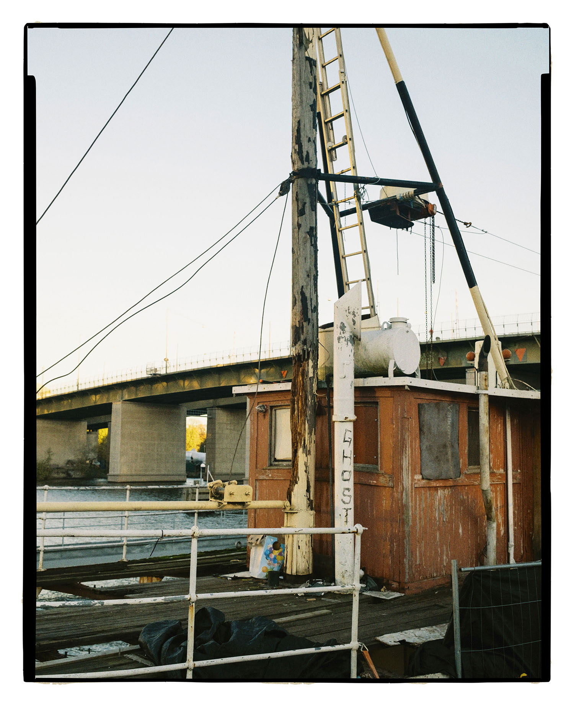
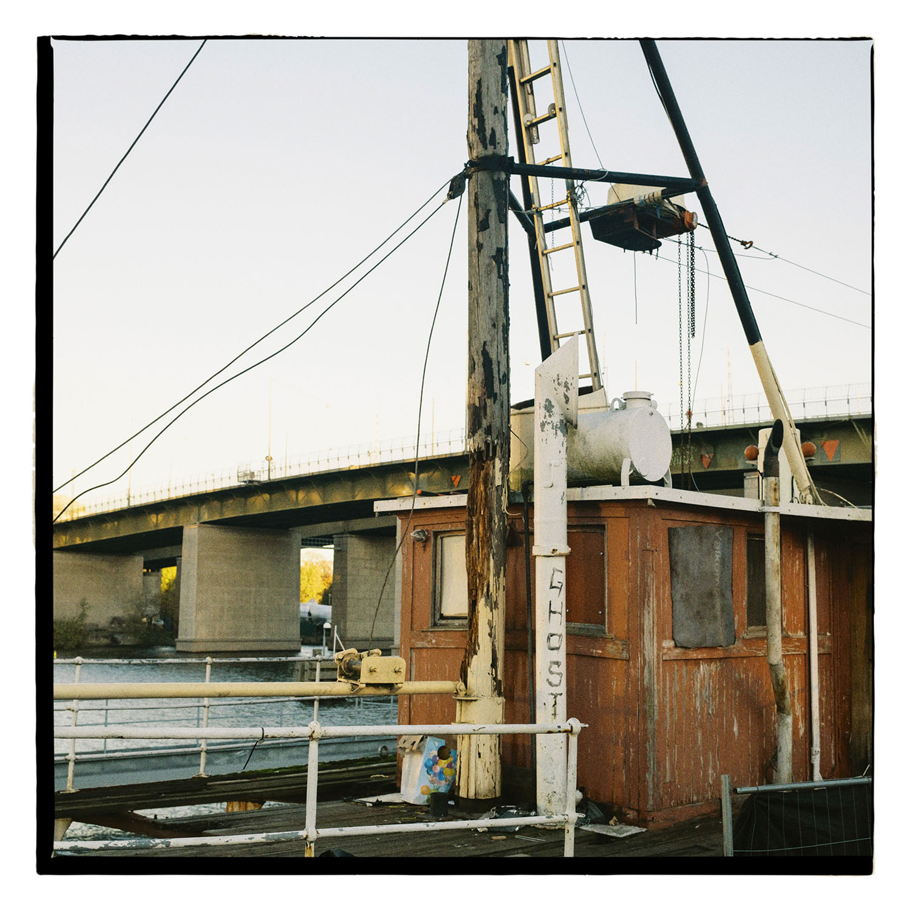

# P O S E R  F R A M E S

by [Joakim Hertze](https://www.hertze.se)

**Poser Frames** is JavaScript for Photoshop that adds fake negative borders, traced from real negatives. It works with images in 3:2, 4:3, 6:7, 4:5 and 1:1 format, with a minimum short side of 1500px. The script automatically chooses a border style depending on the aspect ratio of your image. For some formats, you have a choice between different scanner mask styles.

## Installing and running Poser Frames

1. Copy the script **PoserFrames.jsx** to Photoshop’s scripts folder. On Mac it's in **/Applications/Photoshop 2022/Presets/Scripts** and on Windows 10 it's in **C:\Program Files\Adobe\Adobe Photoshop 2022\Presets\Scripts**. You may have to change the permissions of this folder to copy the script there.

3. Start Photoshop and make sure **PoserFrames** shows up in the menu **File/Scripts**. If you already had Photoshop running when you copied the script to the scripts folder, you may have to restart it.

3. Install the Photoshop action by double-clicking on **PoserFrames.atn**, or by loading it in the Actions palette in Photoshop.

4. Run the script in one of three ways: directly from the menu **File/Scripts/PoserFrames**, by running the action **Run PoserFrames** from the Actions Palette, or by making a droplet with the action **Run PoserFrames** and simply drag and drop your photo on it.

## How to use Poser Frames

The script can be set up to produce quite a few border styles for each frame ratio.

If you open the script **PoserFrames.jsx** in a text editor, you may want to experiment with changing the following settings.

The settings are written as a Javascript variable declaration, like this:

	var fancy = true;

It’s important to keep this format when you make changes. Make sure the `=` or the `;` doesn’t accidentally get deleted when you change value.

Look through the example gallery below. The aspect ratio of your image determines the main style of border applied. A 2:3 image for instance automatically gets the scanner mask style set with the **mask_variant_35mm** setting.

Decide on whether you like a cropped look or a look where the scanner mask is visible in the scan.

If you like a cropped look, experiment with different border thicknesses.

If you like a fancy style, decide if you like a thicker or thinner border, and pick a corresponding scanner mask style.

## List of script settings

1. **fancy**: If set to `true`, the script will simulate a scan with visible scan mask edges. If you like a cropped look, set this to false. Initially set to `false`.
2. **eccentric**: If you want the image area to be centered in the frame, set this to `false`. Initially set to `true`.
3. **mask_variant_35mm**: The style of scanner mask to use with 2:3 images. The script comes with five styles, numbered from 1 to 5. Initially set to `1`.
4. **mask_variant_645**: The style of scanner mask to use with 4:3 images. The script comes with two styles, numbered from 1 to 2. Initially set to `1`.
5. **mask_variant_67**: The style of scanner mask to use with 6:7 images. The script comes with two styles, numbered from 1 to 2. Initially set to `1`.
6. **mask_variant_square**: The style of scanner mask to use with square images. The script comes with two styles, numbered from 1 to 2. Initially set to `1`.
7. **border_width_35mm**: Border width for 35mm format with `fancy = false`. Initially set to `2`.
8. **border_width_645**: Border width for 645 format with `fancy = false`. Initially set to `2`.
9. **border_width_67**: Border width for 6x7 format with `fancy = false`. Initially set to `2`.
10. **border_width_45**: Border width for 4x5 format with `fancy = false`. Initially set to `1`.
11. **border_width_square**: Border width for square format with `fancy = false`. Initially set to `1`.
12. **feather_factor_35mm**: How much feathering of the border you like for 35mm. The lower value, the more feathering. Initial value is `1200`.
13. **feather_factor_645**: How much feathering of the border you like for 645. The lower value, the more feathering. Initial value is `1800`.
14. **feather_factor_67_square**: How much feathering of the border you like for square and 67. The lower value, the more feathering. Initial value is `2400`.
15. **feather_factor_45**: How much feathering of the border you like for 4x5. The lower value, the more feathering. Initial value is `5400`. 

## Settings gallery

*A 3:2 frame with `fancy = false`.*

 

*A 3:2 frame with `fancy = true` and `mask_variant_35mm = 1`.*

 

*A 3:2 frame with `fancy = true` and `mask_variant_35mm = 2`.*

 

*A 3:2 frame with `fancy = true` and `mask_variant_35mm = 3`.*

 

*A 3:2 frame with `fancy = true` and `mask_variant_35mm = 4`.*

 

*A 3:2 frame with `fancy = true` and `mask_variant_35mm = 5`.*

 

*A 4:3 frame with `fancy = false`.*

 

*A 4:3 frame with `fancy = true` and `mask_variant_645 = 1`.*

 

*A 4:3 frame with `fancy = true` and `mask_variant_645 = 2`.*

 

*A 4:5 frame with `fancy = false`.*

 

*A 4:5 frame with `fancy = true`.*

 

with fancy = false
*A 6:7 frame with `fancy = false`.*

 

*A 6:7 frame with `fancy = true` and `mask_variant_67 = 1`.*

 

*A 6:7 frame with `fancy = true` and `mask_variant_645 = 2`.*

 

*A 1:1 frame with `fancy = false`.*

 

*A 1:1 frame with `fancy = true` and `mask_variant_square = 1`.*

 

*A 1:1 frame with `fancy = true` and `mask_variant_square = 2`.*

## Troubleshooting and general tips

- The error message "The document does not contain a selection" means the image dimensions are too small. For technical reasons your image needs to be at least 1500px on it's shortest side for the script to run.

- Consider keeping multiple copies of **PoserFrames.jsx** with different user settings in your scripts folder, for example two named **PoserFrames-fancy.jsx** and **PoserFrames-cropped.jsx**. They'll all show up in Photoshop's scripts menu for easy access. You will have to adjust the action **PoserFrames.atn** when you change the script name and you may want to record separate actions for each script and then  build droplets for them.

- I like to run [the Film Grain](https://thearchetypeprocess.com/collections/adobe-photoshop-actions/products/the-film-grain), from [the Archetype Process](https://thearchetypeprocess.com), on my images after I've run Poser Frames. That way, the borders blend in nicely with the image. If you have Poser Frames in fancy mode, you might have to remove the grain added to the white areas outside of the border. I use the magic wand in Photoshop, and fill the selection with white. I actually have a Photoshop droplet that does this automatically.

## Using ExtractPath.jsx

Install this companion Photoshop script the same way as PoserFrames. This script takes a path named **Frame** in your active Photoshop document, extracts all the path points and saves them to the desktop in the text file **poserframes-path.txt** in a format used in the PoserFrames frame library.

## Credit

Thanks to Marc Holstein and Andreas Georgiou for providing me with scanned negatives.

## License

Poser Frames uses a [**Attribution-ShareAlike 4.0 International (CC BY-SA 4.0) license**](https://creativecommons.org/licenses/by-sa/4.0/).